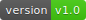
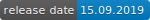
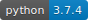
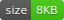
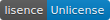
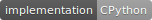

_Have you ever wanted to just open the normal interactive prompt inside of your program and then continue?_\
_Have you ever wanted to debug something without ton of print()s but builtin debugger seems too clumsy?_\
_Me too. I also got solution for it below._


# SEAPIE 2.0

<!--
      
-->

```SEAPIE``` stands for Scope Escaping Arbitrary Python Injection Executor


## Installation
* ```pip3 install seapie```
* or ```pip3 install https://github.com/hirsimaki-markus/SEAPIE/archive/master.zip```
* or clone master, cd master, and ```pip3 install .```
* and to uninstall ```pip3 uninstall seapie```


## Features
A picture tells more than thousands words. Internal !help shown below


```import seapie;seapie.true_exec()``` is provided as interface to autoexecute of version 1.2


## Examples
* Start tracing or to just open interactive prompt: ```from seapie import seapie;seapie()``` and maybe enter ```!help```
* Breakpoint your currently onging tracing: one more ```seapie()```
* Autoexecute stuff when opening the prompt: ```seapie(["print(123)", "!step", "!verbose", "!until 420"])```


## Todo
* Test how seapie works in multithreaded programs
* Send me email or any message anywhere if you have suggestions 


## Known issues
* ```import seapie;seapie.seapie(["plaintextstring"])``` seems to have side effect of setting ```__doc__``` to ```"plaintextstring"```. This should not be problem as autoexecuting just plain string is useless.


## Unlicensing
Distributed under [The Unlicense](https://choosealicense.com/licenses/unlicense/)  by Markus Hirsimäki in 2019 and 2020
