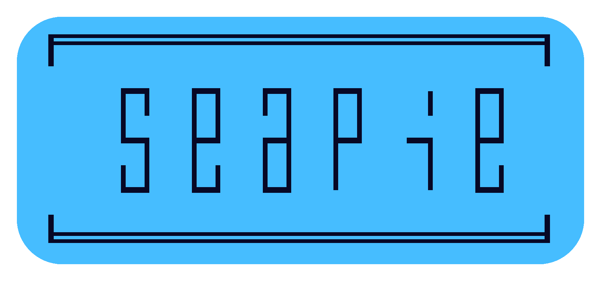

<div align="center">
    <h1>
        
        <br>
        <br>
    </h1>
    <br>
    <a href="https://www.python.org/"></a>
    &nbsp;
    <a href="https://www.python.org/"></a>
    &nbsp;
    <a href="https://github.com/psf/black"></a>
    &nbsp;
    <a href="https://choosealicense.com/licenses/unlicense/"></a>
    &nbsp;
    <a href="https://en.wikipedia.org/wiki/Finland"></a>
    <br>
    <br>
    wololoo
    <br>
    lorem <code>ipsum</code> dolor sit amet
    <br>
    <br>
    <pre>pip install <a href="https://github.com/hirsimaki-markus/seapie">seapie</a></pre>
    <br>
    <br>
    <br>
</div>

## Additional licensing
<details><summary>Show details</summary>

This software is licensed under The Unlicense as the author's protest towards
the modern copyright landscape. If you need a different lisence for a legal or
compability reasons, just ask.

</details>

<br>
<br>

## Documentation
<details><summary>Show details</summary>

```python
>>> import seapie
>>> help(seapie)
>>> # Or take a look at the well documented source.
```

</details>

<br>
<br>


## Development details
<details><summary>Show details</summary>

  **Linting**
  ```bash
  seapie$ python -m isort .
  seapie$ python -m black .
  seapie$ python -m flake8 src/ test/
  ```

  **Testing**
  ```bash
  seapie$ python test/??????
  ```

  **Building & releasing**
  ```bash
  # Remember to increment __version__ in __init__.py
  seapie$ python -m build --wheel && rm -rf build/ && rm -rf src/seapie.egg-info/
  seapie$ python -m twine check dist/*
  seapie$ python -m twine upload dist/*
  seapie$ rm -rf dist/
  ```

</details>